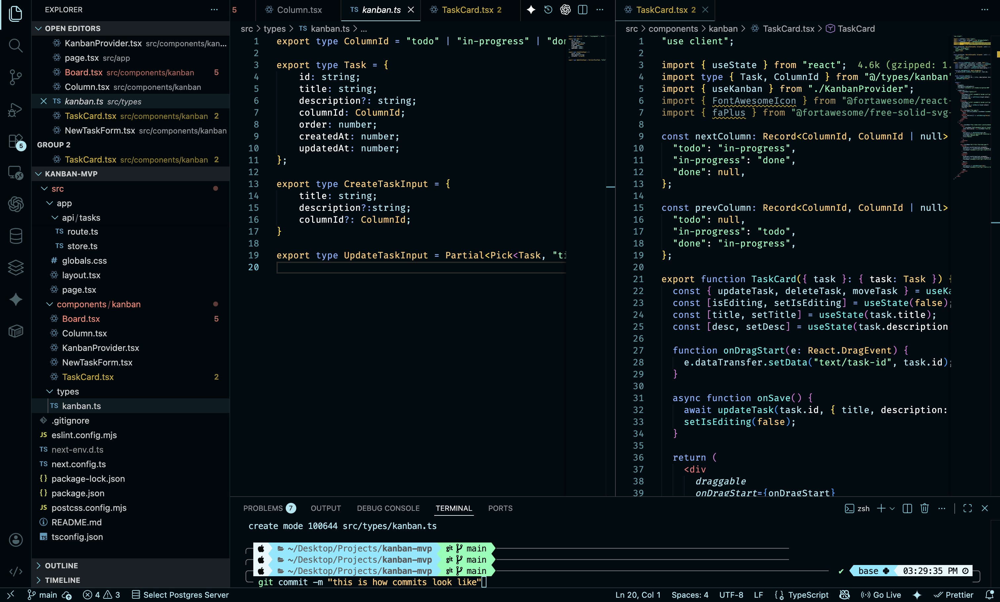
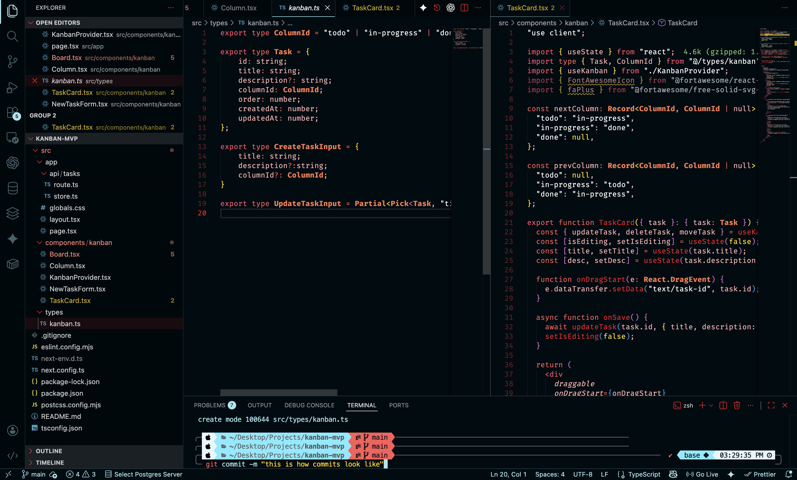
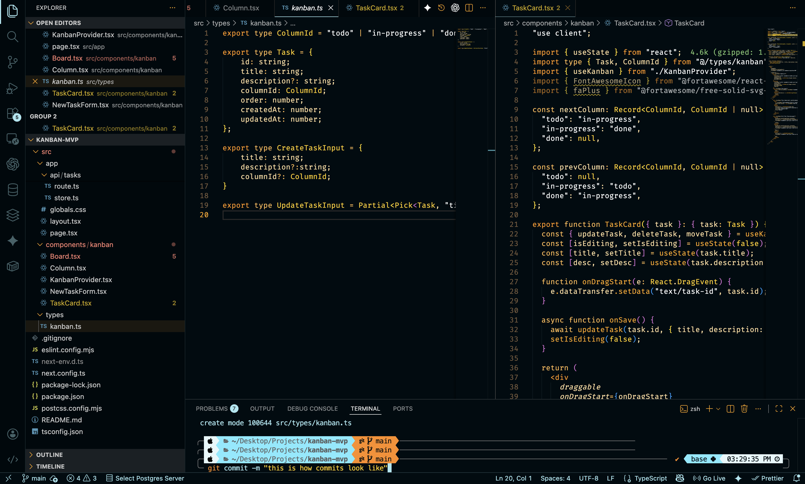

# Encom Tron Legacy Theme Pack

A stunning VSCode theme pack inspired by the iconic visual aesthetics of the Tron Legacy and Tron Ares movies. This pack includes three distinct themes featuring the signature neon blue, orange and red color palettes that define the digital world of Tron.

## 🎨 Themes Included

### Tron Legacy - Encom
The classic Encom corporate interface theme with sleek blues and professional styling.

### Tron - Ares
Inspired by the character Ares, featuring balanced red and orange accents.

### Tron Legacy - CLU
The aggressive CLU theme with prominent orange highlights representing the antagonist's world.

## 📦 Installation

1. Open **Extensions** sidebar panel in VS Code. `View → Extensions`
2. Search for `Troning`
3. Click **Install**
4. Click **Reload** to reload your editor
5. Go to `Code > Preferences > Color Theme` (or `File > Preferences > Color Theme` on Windows/Linux)
6. Select one of the Tron Legacy themes

### Manual Installation

1. Clone this repository
2. Copy the folder to your VS Code extensions directory:
   - **Windows:** `%USERPROFILE%\.vscode\extensions`
   - **macOS/Linux:** `~/.vscode/extensions`
3. Restart VS Code

## 🎯 Theme Activation

1. Press `Ctrl+K Ctrl+T` (or `Cmd+K Cmd+T` on macOS)
2. Select from:
   - **Tron Legacy - Encom**
   - **Tron - Ares**
   - **Tron Legacy - CLU**

## ✨ Features

- Three distinct dark themes with Tron-inspired color palettes
- Signature neon blue and orange syntax highlighting
- Authentic Tron Legacy movie aesthetics
- Optimized for multiple programming languages
- Enhanced readability with carefully selected contrast ratios

## 🤝 Contributing

Found a bug or have a suggestion? Feel free to open an issue or submit a pull request on [GitHub](https://github.com/ruben-cxtx/best-tron-legacy-theme).

## 📝 License

This theme is licensed under the MIT License. See [LICENSE](LICENSE) file for details.

## 🙏 Acknowledgments

Inspired by the visual design of Tron Legacy (2010) directed by Joseph Kosinski.

---

**Enjoy coding in the Grid and making Bio-digital Jazz** ⚡
