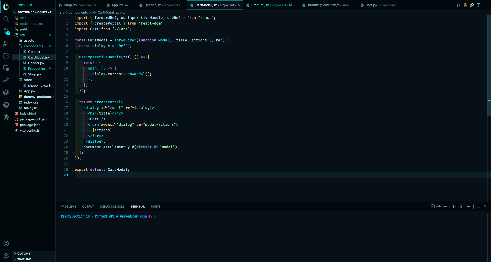
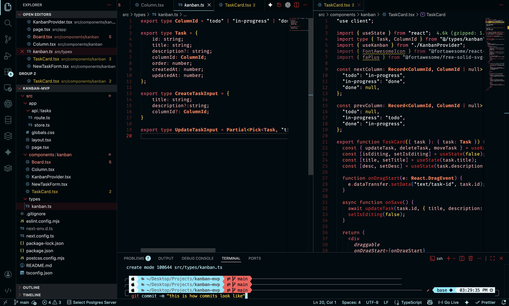
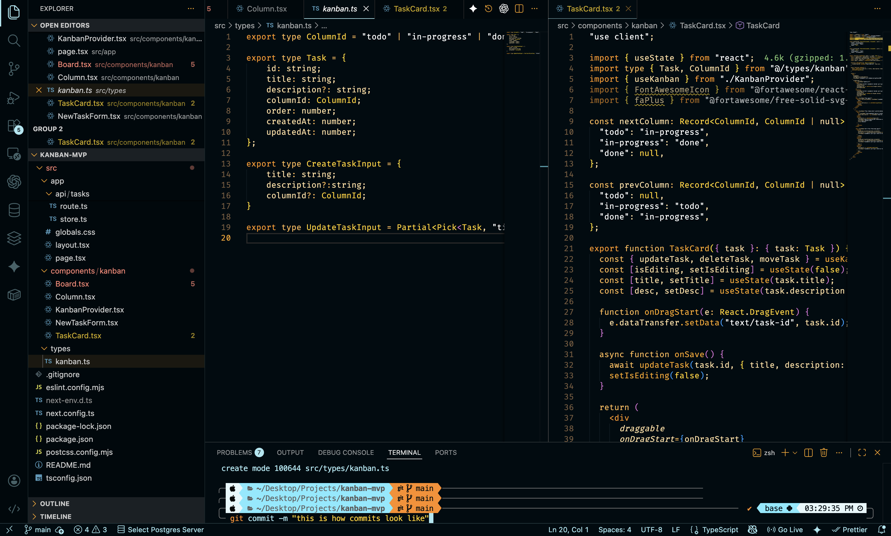

# Troning - Tron Legacy Theme Pack

A VS Code theme pack inspired by the digital world of Tron, rebuilt for everyday full-stack programming. Troning now includes five dark flavors with semantic highlighting, deeper workbench coverage, tuned terminal ANSI colors, and syntax rules for frontend, backend, infrastructure, data, and AI/Python work.

## Themes Included

### Tron Legacy - Encom
The flagship flavor. Deep blue-black UI, cyan circuitry, cool ice foregrounds, and careful amber/green signal accents for readable React, Next.js, Node, NestJS, Astro, Tailwind, Markdown, SQL, YAML, Docker, Kubernetes, CI/CD, and Python code.



### Tron Legacy - Encom Clean
The same Encom palette without italic styling, built for people who prefer a quieter coding surface while keeping the cyan, purple keyword, amber, and green signal language.

### Tron - Ares
Red/orange program energy for a hotter Grid look, with softer foregrounds so it stays usable during long coding sessions.



### Tron Legacy - CLU
Golden-orange command surface inspired by CLU's world, with amber types, bright functions, and high-contrast strings.



### Tron - Retro Grid
An arcade-inspired retro Tron flavor with blue neon, electric green signals, and warm amber values.

## Installation

1. Open **Extensions** sidebar panel in VS Code. `View → Extensions`
2. Search for `Troning`
3. Click **Install**
4. Click **Reload** to reload your editor
5. Go to `Code > Preferences > Color Theme` (or `File > Preferences > Color Theme` on Windows/Linux)
6. Select one of the Tron Legacy themes

### Manual Installation

1. Clone this repository
2. Copy the folder to your VS Code extensions directory:
   - **Windows:** `%USERPROFILE%\.vscode\extensions`
   - **macOS/Linux:** `~/.vscode/extensions`
3. Restart VS Code

## Theme Activation

1. Press `Ctrl+K Ctrl+T` (or `Cmd+K Cmd+T` on macOS)
2. Select from:
   - **Tron Legacy - Encom**
   - **Tron Legacy - Encom Clean**
   - **Tron - Ares**
   - **Tron Legacy - CLU**
   - **Tron - Retro Grid**

## Features

- Five distinct dark themes with Tron-inspired palettes
- Semantic highlighting enabled for modern language servers
- Broad TextMate scope coverage for JS, TS, React, Next.js, MDX, Node, NestJS, Astro, Tailwind, HTML, CSS, SQL, Markdown, YAML, Docker, Kubernetes, GitLab CI, shell, and Python
- Rich workbench styling for tabs, panels, lists, settings, notifications, diagnostics, testing, notebooks, symbol icons, debug controls, Git decorations, merge/diff views, minimap markers, breadcrumbs, and peek views
- Terminal ANSI palettes matched to each flavor
- Generator-backed theme files with a contrast check for token colors
- Theme lab examples for TSX, MDX, Markdown, Astro, NestJS, Python, SQL, YAML, Docker, Kubernetes, and GitLab CI

## Development

Theme JSON files are generated from `scripts/build-themes.js`.

```sh
npm run build
npm run check
npm run package
```

The `examples/` folder contains fixture files for visual testing when tuning token colors across React, MDX, Markdown, Astro, NestJS, Python, SQL, YAML, Docker, Kubernetes, and CI/CD. GitHub Actions validate generated themes on pushes and pull requests, and the publish workflow can publish tagged releases when `VSCE_PAT` is configured as a repository secret.

## Support

If you enjoy this theme and want to support its development, consider buying me a coffee!

[](https://buymeacoffee.com/rubenzn)

Your support helps maintain and improve this theme, and also help me with future projects. Thank you!

## Contributing

Found a bug or have a suggestion? Feel free to open an issue or submit a pull request on [GitHub](https://github.com/ruben-cxtx/best-tron-legacy-theme).

## License

This theme is licensed under the MIT License. See [LICENSE](LICENSE) file for details.

## Acknowledgments

Inspired by the visual design of Tron Legacy (2010) directed by Joseph Kosinski.

---

**Enjoy coding in the Grid and making bio-digital jazz.**
